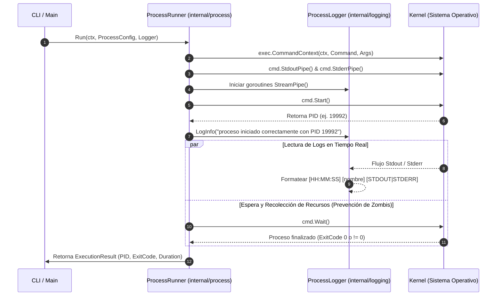
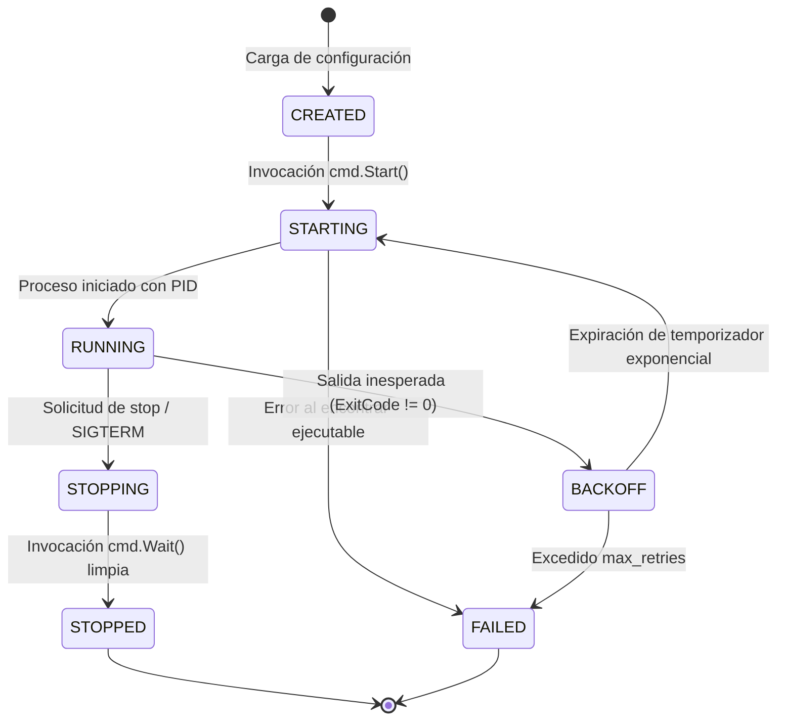

# Diagramas y Gráficos Arquitectónicos del Proyecto

Este directorio contiene los diagramas arquitectónicos y de flujo del **Go Process Supervisor**.

---

## 1. Diagrama de Arquitectura General

```mermaid
graph TD
    CLI[Usuario / CLI<br/>validate | run | version] -->|Comando / Config JSON| SUP[Supervisor Global]
    
    subgraph Core System
        SUP --> CFG[Config Loader & Validator<br/>internal/config]
        SUP --> PM[Process Manager<br/>internal/supervisor]
        SUP --> SIG[Signal Handler<br/>internal/signals]
        SUP --> API[API Server HTTP<br/>internal/api]
    end
    
    subgraph Execution Layer
        PM --> PR1[Process Runner 1<br/>worker-estable]
        PM --> PR2[Process Runner 2<br/>worker-falla]
    end

    subgraph Logging Layer
        PR1 -->|Stdout / Stderr| LOG[Process Logger<br/>internal/logging]
        PR2 -->|Stdout / Stderr| LOG
    end

    subgraph Child Processes (OS)
        PR1 -->|os/exec| P1[Proceso Hijo 1<br/>PID 19992]
        PR2 -->|os/exec| P2[Proceso Hijo 2<br/>PID 25112]
    end
```

---

## 2. Diagrama de Flujo de Ejecución del Runner (Parte 2)



---

## 3. Diagrama de Máquina de Estados por Proceso


