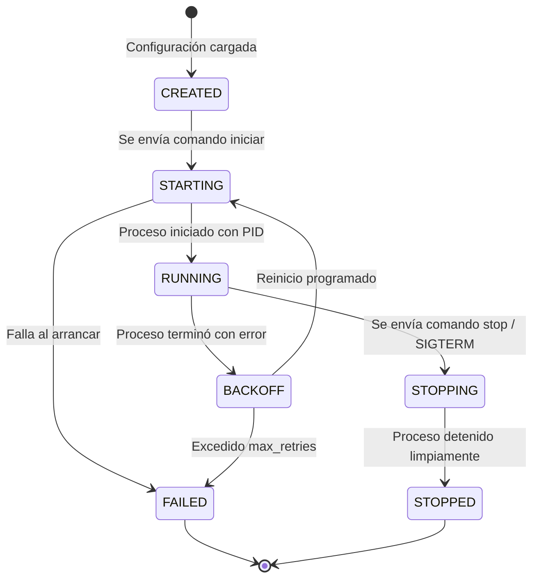

# Diagrama de Máquina de Estados por Proceso

```mermaid
stateDiagram-v2
    [*] --> CREATED: Configuración cargada
    CREATED --> STARTING: Se envía comando iniciar
    STARTING --> RUNNING: Proceso iniciado con PID
    STARTING --> FAILED: Falla al arrancar
    RUNNING --> STOPPING: Se envía comando stop / SIGTERM
    STOPPING --> STOPPED: Proceso detenido limpiamente
    RUNNING --> BACKOFF: Proceso terminó con error
    BACKOFF --> STARTING: Reinicio programado
    BACKOFF --> FAILED: Excedido max_retries
    FAILED --> [*]
    STOPPED --> [*]
```